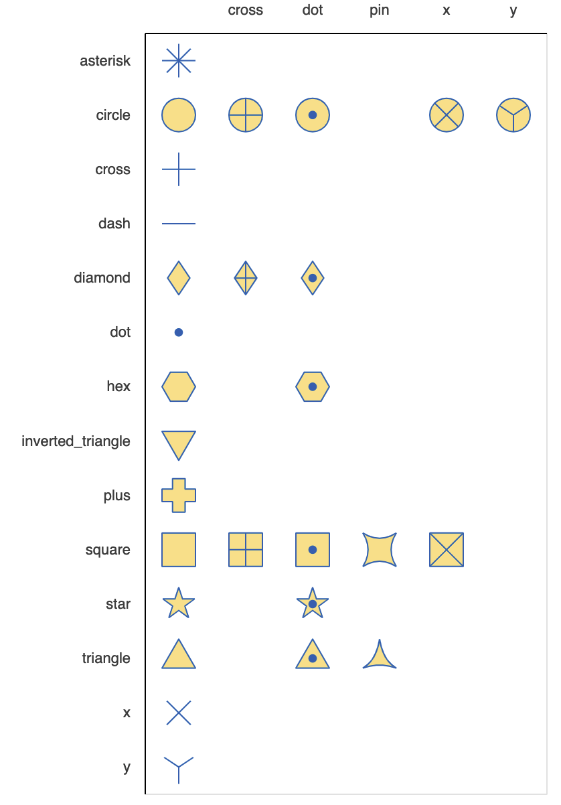

# Bokeh usage notes

Here are a few notes on how to get started with Bokeh's plotting features. The full documentation is at https://docs.bokeh.org/en/latest/

For more examples https://github.com/bokeh/bokeh/tree/master/examples

## imports 

    from bokeh.plotting import figure, show, save
    from bokeh.layouts import column
    from bokeh.models import ColumnDataSource, FixedTicker, MultiLine, Grid, Plot, LinearAxis, Legend, Span, VBar,
    from bokeh.io import output_notebook
    from bokeh import palettes
    output_notebook()

## tl;dr

    def qplot(x,y,c='red'):
        p = figure(width = 1000, height = 300, x_range=(0,1))
        p.line(x=x, y=y, line_color=c)
        return p

    show(qplot(x=df.index, y=df[1].values))

## figures

    p= figure(
        title="Plot",
        width = 1000, height = 600, 
        background_fill_color="#fafafa",
        x_range=(0, 20), y_range = (-1,0),
        x_axis_type="datetime",
        y_axis_type="log",
        x_axis_label = 'Length',
        y_axis_label = 'Width',
        toolbar_location=None  # to eliminate the default tool panel on the right
    )

Or individual properties may be set by

    p.xaxis.axis_label = 'Length'
    p.grid.grid_line_color="white"

## plots

    # by passing a pandas df, columns can be referenced by name as strings. The default '0' column
    # isn't accepted by Bokeh - you need to set a string column name. 
    source = ColumnDataSource(a_dataframe)
or 

    source = ColumnDataSource(dict(x=[..], y=[..], color=['#dddddd', 'blue', ..]))

to see it's contents:

    source.data.keys()

or update it's contents:

    source.data = dict(<key>, <value>)

### graphic objects

    p.line(x='x', y='y', color='color', source=source, 
            line_color="black", line_width=1, alpha=1.0, line_dash = 'dotdash', legend_label="Data")

line_dash values:  “dashed”, “dotted”, “dotdash”, “dashdot”

Similarly, for convenience,

    p.circle(.., color =..)
    p.square(..) 

But more generally to place a defined shape on an x,y plot Bokeh has several dozen marker types, including `dot` and `cross`:

    p.scatter(x, y, marker="dot", size=15,
              line_color="navy", fill_color="orange", alpha=0.5)

Markers can also be a data type in a ColumnDataSource

    source.data['markers'] = ["circle", "square", "circle", ... ]
    glyph = Scatter(..., marker="markers")
    p.add_glyph(source, glyph)

For legends,

    p.legend.location = "center_right"  # Assume there's a default if no properties are set.

or a legend outside the plot area

    lg = Legend(items= [..], location = (0,100))
    p.add_layout(lg)

## glyphs

Glyphs are a general term for shapes of all sorts: polygons, areas. Use the constructor function (In CamelCaps), then render it by calling `add_layout`:

To add annotations, one plots text labels at x,y coordinates. The data comes from a dict, or DataFrame:

    datasource = ColumnDataSource(data=dict(labels=[..], x=[..], y=[..]))
    labels = LabelSet(x=x, y=y, text=labels, source=datasource)
    p.add_layout(labels)

instead  use `text()` for alignment, and multi-line options: 

    p.text(x, y, text=["(%d, %d)" % (q,r) for (q, r) in zip(q, r)],
       text_baseline="middle", text_align="center", text_color='navy', text_font_size="26px")) 

For a rectangular area glyph that spans the plot:

    band = Band(base='TimeStampUtc', lower='low_std', upper='upper_std', source=cds,   level='underlay', fill_alpha=1.0, line_width=1, line_color='black')

For Vertical and Horizontal lines:

    vline = Span(location=0, dimension='height', line_color='red', line_width=3)
    hline = Span(location=0, dimension='width', line_color='green', line_width=3)
    p.renderers.extend([vline, hline])

A Segment, e.g. vector, specified by origin, length and angle:

    p.ray(x, y, length, angle=np.pi, angle_units="rad")

Angles are by default specified in radians ("rad"). Alternatively use "deg" for degrees. 

## Palettes

The palette needs to know the number of colors in the range, to obtain an array of colors.  E.g. In Category10, the 2nd color from a range of 5 colors is
`Category10[5][1]`

## Color Maps

An explicitly listed map

    colormap = {'setosa': 'red', 'versicolor': 'green', 'virginica': 'blue'}
    colors = [colormap[x] for x in data['species']]
    src = ColumnDataSource(dict(.., color=colors))

or

    color_map = CategoricalColorMapper( factors = [category1, ..], palette=[color1, ..])
    p.circle( .., color= dict(transfor=color_map)) ?? 

## Histograms

    hhist, bin_edges = np.histogram(x, bins=bin_ct, density=False)
    # A cute way to pass shared args
    LINE_ARGS = dict(color='white', line_color='black')
    # Define the sides of each "box" in the histogram plot
    a_figure.quad(bottom=0, left=bin_edges[:-1], right=bin_edges[1:], top=hhist, **LINE_ARGS)

where `len(hhist) = bins` and `len(bin_edges) = bins+1`

or use Vbar glyphs.

    normal_hist_df = pd.DataFrame(dict(density= hhist, rv= bin_edges[:-1]))
    hist_src = ColumnDataSource(normal_hist_df)
    glyph = VBar(x='rv', top='density', bottom=0, width=(bin_edges[-1] - bin_edges[0])/bin_ct, fill_color='limegreen')
    p.add_glyph(hist_src, glyph)

Note, for a categorical axis, pass a list of enumerations to figure()

    categories = ['apple', 'banana', 'cherry']
    y = [12, 4, 7]
    p = figure(x_range = categories)
    glyph = VBar(x=categories, top=y, bottom=0, width=1, line_width=0)
    p.add_glyph(cds, glyph)

## Multiple objects in one graphic

    show(row(p11, column(p21, p22)))

or

    show(gridplot([[p11, p12], [None, p22]]),
                  plotwidth=.., plotheight
                  =..)  # Results in a single toolbar for all plots

or

    show(gridplot([p1, p2, ...], ncols=2))

See also

    layout([[p11, p12], [p22], ..])

## Output

Plots may be displayed in notebooks in-line by calling

    output_notebook()

in the notebook session.  Then to see the plot embedded in a cell's output, call

    show(plot_obj)

Alternately to save as an html file call: (It's one or the other.)

    save(plot_obj, title="..", filename="...html")

or call

    output_file('some.html') 

and `show()` will redirect to the file. 

## Embedding in html documents. 

This command writes out html fragments to place the figure in an html document. 

    from bokeh.embed import components
    script, div = components(p_figure)

    The `div` part gets placed in the area of the <body> where the plot should appear.
    The `script` part also goes in the body section after all content.

    In addition the <head> section needs this snippet to load the bokeh library:
        
        
  </head>

John Mark Agosta, licensed under Creative Commons, "Attribution, Non-Commercial" 

